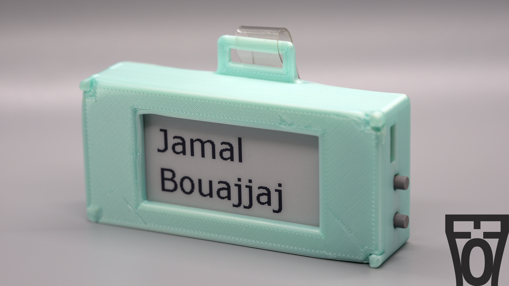
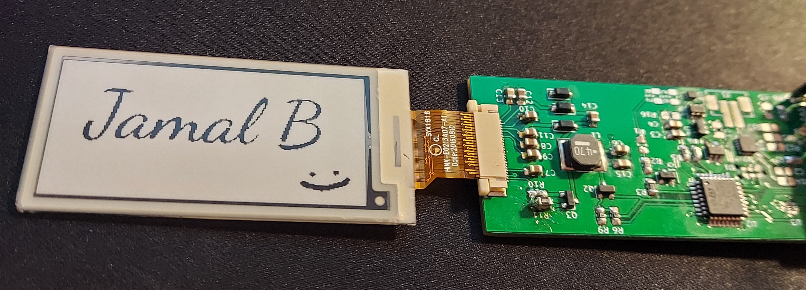

# E-Ink Name Tab Project, by Electro707

This project is for a E-Ink name-tag, meant to be the cooler replacement for a paper name-tag for event and shows.

## Directory

- `STM32CubeIDE`: The firmware created with STM32CubeIDE
- `PCB`: PCB Files made with KiCAD
- `PythonUploader`: A Python GUI and class to communicate with the e-ink tag, mainly to update the "frames"
- `CAD`: Mechanical enclosure made with FreeCAD
